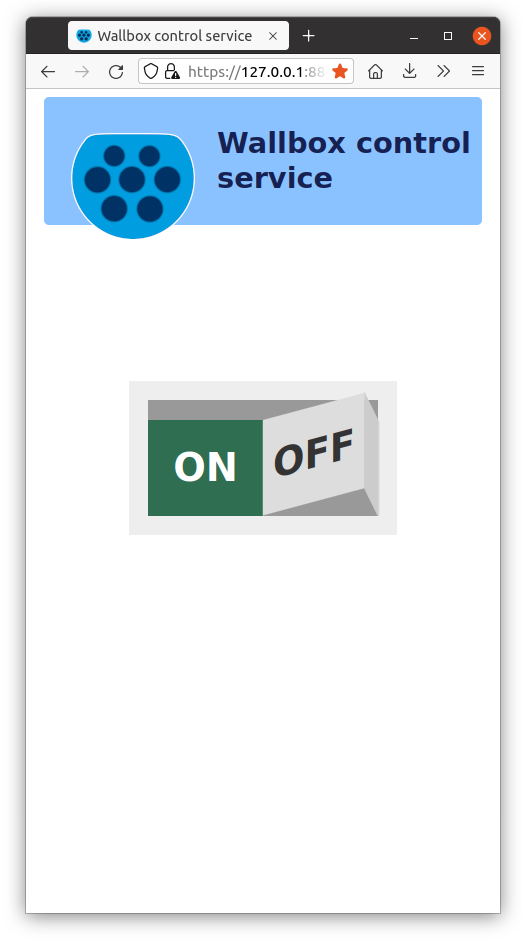
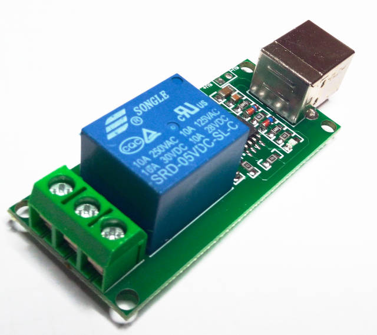
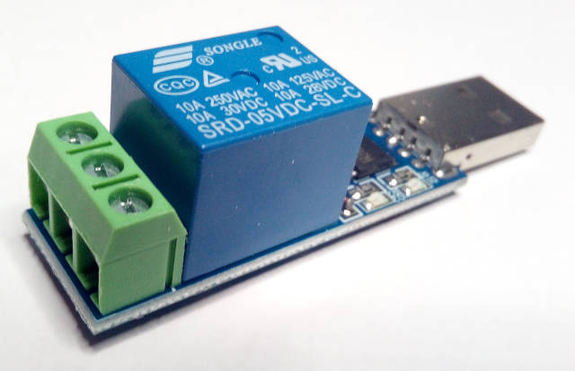
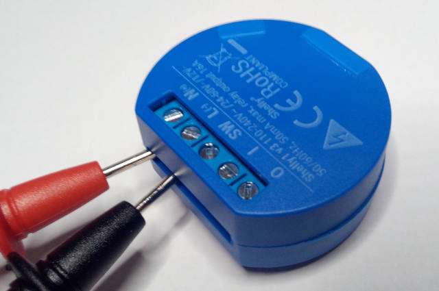

# Wallbox control service

Little single page webservice that provides control to a simple wallbox.

Since I have a parking space in front of the house, I've decided to buy a small NEV (new energy vehicle) or BEV (battery electric vehicle) and installed a *Heidelberg Wallbox Home Eco* to charge the battery of the car. It is a simple wallbox (which isn't much more than a fancy three-phase wall outlet) without wifi or electricity meter. Inside of the wallbox two wires can be attached instead of a default wired bridge to control if the wallbox will charge the car or not.

- If the two contacts are closed, the wallbox will charge a connected car.
- if the two contacts are open, no power will be provided.

Simple.

These two wires will be connected to some kind of electronic switch, so that I can control the wallbox from a computer. Even outside the house I am in range of my wifi network, so using a web application to switch the charging *on* or *off* seemed a natural choice. No need to fiddle around with an extra key or RFID card.

I could have used an apache web server with some php but where is the fun in that? Rust is the new kid in town and so it was play time :-)

The web server calls external commands to switch the relay, so it could easily be adapted to other relay types or even a Raspberry Pi.



Isn't it a bit overengineered? Yes, it is.


## Relay

## Relay - USB - HID device

The relay I wanted to use works as a HID device, so that no drivers are necessary, even the current state can be queried.



Stories of usb thumb drives acting as HID device and hacking your computer come to my mind, keep the fingers crossed... :-)

I've installed the `usbrelay` package on Ubuntu 20.04 LTS and got this infos when executing the command:

```bash
usbrelay                      
Device Found
  type: 16c0 05df
  path: /dev/hidraw3
  serial_number: 
  Manufacturer: www.dcttech.com
  Product:      USBRelay1
  Release:      100
  Interface:    0
  Number of Relays = 1
959BI_1=0
```

It works fine on Ubuntu but sadly not with [OmniOS](https://omnios.org/), probably because the device uses `0` as protocol and the driver only accepts keyboards and mice.

```bash
lsusb -v -d 1d6b:0002
Bus 001 Device 004: ID 16c0:05df Van Ooijen Technische Informatica HID device except mice, keyboards, and joysticks
Device Descriptor:
  bLength                18
  bDescriptorType         1
  bcdUSB               1.10
  bDeviceClass            0 
  bDeviceSubClass         0 
  bDeviceProtocol         0 
  bMaxPacketSize0         8
  idVendor           0x16c0 Van Ooijen Technische Informatica
  idProduct          0x05df HID device except mice, keyboards, and joysticks
  bcdDevice            1.00
  iManufacturer           1 www.dcttech.com
  iProduct                2 USBRelay1
  iSerial                 0 
  bNumConfigurations      1
  Configuration Descriptor:
    bLength                 9
    bDescriptorType         2
    wTotalLength       0x0022
    bNumInterfaces          1
    bConfigurationValue     1
    iConfiguration          0 
    bmAttributes         0x80
      (Bus Powered)
    MaxPower               20mA
    Interface Descriptor:
      bLength                 9
      bDescriptorType         4
      bInterfaceNumber        0
      bAlternateSetting       0
      bNumEndpoints           1
      bInterfaceClass         3 Human Interface Device
      bInterfaceSubClass      0 
      bInterfaceProtocol      0 <============ there is the culprit
      iInterface              0 
        HID Device Descriptor:
          bLength                 9
          bDescriptorType        33
          bcdHID               1.01
          bCountryCode            0 Not supported
          bNumDescriptors         1
          bDescriptorType        34 Report
          wDescriptorLength      22
         Report Descriptors: 
           ** UNAVAILABLE **
      Endpoint Descriptor:
        bLength                 7
        bDescriptorType         5
        bEndpointAddress     0x81  EP 1 IN
        bmAttributes            3
          Transfer Type            Interrupt
          Synch Type               None
          Usage Type               Data
        wMaxPacketSize     0x0008  1x 8 bytes
        bInterval              20
Device Status:     0x0000
  (Bus Powered)
```

See the files in the [conf.usbhid.prod](./conf.usbhid.prod) directory. You may need to run the scripts as root, add `sudo` to run the `usbrelay` command as root or add an extra [udev rule](https://github.com/darrylb123/usbrelay) to use the device as a unprivileged user.


## Relay - USB - seriel port

There is an alterative that emulates a serial port. This wasn't my first choice because the few documents I found claimed that it is not possible to query the state of the relay. Therefore I need to store the state which is easy to do but could get out of sync with the real device.



```bash
lsusb -v -d 1a86:7523
Bus 001 Device 004: ID 1a86:7523 QinHeng Electronics HL-340 USB-Serial adapter
Couldn't open device, some information will be missing
Device Descriptor:
  bLength                18
  bDescriptorType         1
  bcdUSB               1.10 
  bDeviceClass          255 Vendor Specific Class
  bDeviceSubClass         0 
  bDeviceProtocol         0 
  bMaxPacketSize0         8
  idVendor           0x1a86 QinHeng Electronics
  idProduct          0x7523 HL-340 USB-Serial adapter
  bcdDevice            2.64
  iManufacturer           0 
  iProduct                2 
  iSerial                 0 
  bNumConfigurations      1
  Configuration Descriptor:
    bLength                 9
    bDescriptorType         2
    wTotalLength       0x0027
    bNumInterfaces          1
    bConfigurationValue     1
    iConfiguration          0 
    bmAttributes         0x80
      (Bus Powered)
    MaxPower               98mA
    Interface Descriptor:
      bLength                 9
      bDescriptorType         4
      bInterfaceNumber        0
      bAlternateSetting       0
      bNumEndpoints           3
      bInterfaceClass       255 Vendor Specific Class
      bInterfaceSubClass      1 
      bInterfaceProtocol      2 
      iInterface              0 
      Endpoint Descriptor:
        bLength                 7
        bDescriptorType         5
        bEndpointAddress     0x82  EP 2 IN
        bmAttributes            2
          Transfer Type            Bulk
          Synch Type               None
          Usage Type               Data
        wMaxPacketSize     0x0020  1x 32 bytes
        bInterval               0
      Endpoint Descriptor:
        bLength                 7
        bDescriptorType         5
        bEndpointAddress     0x02  EP 2 OUT
        bmAttributes            2
          Transfer Type            Bulk
          Synch Type               None
          Usage Type               Data
        wMaxPacketSize     0x0020  1x 32 bytes
        bInterval               0
      Endpoint Descriptor:
        bLength                 7
        bDescriptorType         5
        bEndpointAddress     0x81  EP 1 IN
        bmAttributes            3
          Transfer Type            Interrupt
          Synch Type               None
          Usage Type               Data
        wMaxPacketSize     0x0008  1x 8 bytes
        bInterval               1
```

It works fine with Ubuntu, the relay can be switched on and of via `echo`:

```bash
# turn on
echo -e '\xA0\x01\x01\xA2' > /dev/ttyUSB0
#               ^   ^   ^
#               |   |   |
#               |   |   +-- checksum
#               |   +------ on
#               +---------- relay no. 1     
#
#
# turn off
echo -e '\xA0\x01\x00\xA1' > /dev/ttyUSB0
#               ^   ^   ^
#               |   |   |
#               |   |   +-- checksum
#               |   +------ off
#               +---------- relay no. 1     
```

Or start

```bash
picocom -b 9600 -r -l /dev/ttyUSB0
```

and press `[CTRL]+A` `[CTRL]+W`

```
*** hex: A00101A2
```

press `[ENTER]`

```
*** wrote 4 bytes ***
```


See the files in the [conf.usbtty.prod](./conf.usbtty.prod) directory. You may need to run the scripts as root, add `sudo` to run the `echo` command as root or add an extra *udev rule* to use the device as a unprivileged user.


## Relay - Shelly

Well, this is the escalation of overengineering. You could basically use the app that controls the Shelly device and wouldn't need this project here at all.



Or you could use your browser to connect to the wallbox web service that starts a script that calls the REST API of the Shelly device.

And that's excactly what I am doing at home. Because the Shelly app that must be used is way too slow. With the web service I have already switched that relay before that app has even started. And it can be used from any browser available at home.

It does not use SSL/TLS - meh. Probably I am going to shield it with a firewall in a distinct wifi and vlan.


# Wiring

I do not provide any information to wire the relais and/or the wallbox. Consult a professional electrician, we are talking about 400V here!


## Authentication

Since the web service is running via HTTPS in my home network, [basic auth](https://en.wikipedia.org/wiki/Basic_access_authentication) should be enough. If someone breaches into my network, I've got bigger problems than the possible usage of my wallbox.

Of course I do not use `secret` as a password ;-)

Well, after the decission to use the Shelly relay, it doesn't count anymore. The mobile browsers like Chrome and Firefox didn't want to store the credentials, so I commented the respective lines out. Maybe I come back to that later in time.


## SSL/TLS

For development a self signed certificate is included, in production I use a certificate from my home CA that is set to be trusted in my browsers. On Android devices the Google Chrome and Firefox mobile browser seem to be very picky about certficates even if my home CA certificate is imported in the Android trust store. Therefore I use the [monocles browser](https://f-droid.org/de/packages/de.monocles.browser/) which is also picky but can pin the used certificate so that I don't need to fiddle around with those misleading security dialogs. The certificate is accepted by a bunch of different browsers on different operating systems. So the root of the problem is probably somewhere in the alphabet soup a.k.a. Android.

```bash
mkdir conf.dev && cd conf.dev
openssl req -x509 -sha256 -nodes -days 365 -newkey rsa:4096 -keyout wb-selfsigned.key -out wb-selfsigned-cert.pem
Generating a RSA private key
.......++++
...............................................................++++
writing new private key to 'wb-selfsigned.key'
-----
You are about to be asked to enter information that will be incorporated
into your certificate request.
What you are about to enter is what is called a Distinguished Name or a DN.
There are quite a few fields but you can leave some blank
For some fields there will be a default value,
If you enter '.', the field will be left blank.
-----
Country Name (2 letter code) [AU]:DE
State or Province Name (full name) [Some-State]:NRW
Locality Name (eg, city) []:Luenen
Organization Name (eg, company) [Internet Widgits Pty Ltd]:^C
╭─sven@prometheus-ubuntu ~/Documents/src/wallboxsvc/conf.dev ‹master*› 
╰─$ openssl req -x509 -sha256 -nodes -days 365 -newkey rsa:4096 -keyout wb-selfsigned.key -out wb-selfsigned-cert.pem                                                130 ↵
Generating a RSA private key
(...)
Country Name (2 letter code) [AU]:DE   
State or Province Name (full name) [Some-State]:NRW 
Locality Name (eg, city) []:lab
Organization Name (eg, company) [Internet Widgits Pty Ltd]:acme.local
Organizational Unit Name (eg, section) []:org
Common Name (e.g. server FQDN or YOUR name) []:acme.local
Email Address []:rainer.zufall@acme.local
```


# API

The "API" consists of only two methods and the responses are expected to be provided by the external commands that are used to set and query the relay state.

- **GET** `/get/relay_state`

     An external command gets called, see `get_relay_state_command` in the JSON configuration file.

     *Response body*

     ```
     {"state":"on"}
     ```

     or 

     ```
     {"state":"off"}
     ```

     if you are unlucky

     ```
     {"state":"unknown"}
     ```
- **GET** `/set/relay_state/{new_state}`

     valid values for `{new_state}` :
     - `on`
     - `off` 

     An external command gets called, see `set_relay_state_command` in the JSON configuration file. `{new_state}` is passed as only argument.

     The external command is expected to set the relay state, wait for execution and query the new state.

     Response body

     ```
     {"state":"on"}
     ```

     or 

     ```
     {"state":"off"}
     ```

     If you are unlucky

     ```
     {"state":"unknown"}
     ```


# License

```
The MIT License (MIT)

Copyright © 2021 by Sven Putze (https://github.com/hardcodes/)

Permission is hereby granted, free of charge, to any person obtaining a copy of this software and associated documentation files (the “Software”), to deal in the Software without restriction, including without limitation the rights to use, copy, modify, merge, publish, distribute, sublicense, and/or sell copies of the Software, and to permit persons to whom the Software is furnished to do so, subject to the following conditions:

The above copyright notice and this permission notice shall be included in all copies or substantial portions of the Software.

THE SOFTWARE IS PROVIDED “AS IS”, WITHOUT WARRANTY OF ANY KIND, EXPRESS OR IMPLIED, INCLUDING BUT NOT LIMITED TO THE WARRANTIES OF MERCHANTABILITY, FITNESS FOR A PARTICULAR PURPOSE AND NONINFRINGEMENT. IN NO EVENT SHALL THE AUTHORS OR COPYRIGHT HOLDERS BE LIABLE FOR ANY CLAIM, DAMAGES OR OTHER LIABILITY, WHETHER IN AN ACTION OF CONTRACT, TORT OR OTHERWISE, ARISING FROM, OUT OF OR IN CONNECTION WITH THE SOFTWARE OR THE USE OR OTHER DEALINGS IN THE SOFTWARE.
```

The license is also included as LICENSE-MIT file and applies only to my own code and/or contributions!


# Appendix

- The icon was inspired by [Wikipedia](https://de.wikipedia.org/wiki/Datei:Stecker-Typ_2_Belegung.svg)
- The css code for the rocker switch was taken from

     https://codemyui.com/checkbox-designed-as-rocker-switch-in-pure-css/
 
    > Copyright (c) 2021 by Marcus Connor (https://codepen.io/marcusconnor/pen/QJNvMa)
    >
    > Permission is hereby granted, free of charge, to any person obtaining a copy of this software and associated documentation files (the "Software"), to deal in the Software without restriction, including without limitation the rights to use, copy, modify, merge, publish, distribute, sublicense, and/or sell copies of the Software, and to permit persons to whom the Software is furnished to do so, subject to the following conditions:
    >
    > The above copyright notice and this permission notice shall be included in all copies or substantial portions of the Software.
    >
    > THE SOFTWARE IS PROVIDED "AS IS", WITHOUT WARRANTY OF ANY KIND, EXPRESS OR IMPLIED, INCLUDING BUT NOT LIMITED TO THE WARRANTIES OF MERCHANTABILITY, FITNESS FOR A PARTICULAR PURPOSE AND NONINFRINGEMENT. IN NO EVENT SHALL THE AUTHORS OR COPYRIGHT HOLDERS BE LIABLE FOR ANY CLAIM, DAMAGES OR OTHER LIABILITY, WHETHER IN AN ACTION OF CONTRACT, TORT OR OTHERWISE, ARISING FROM, OUT OF OR IN CONNECTION WITH THE SOFTWARE OR THE USE OR OTHER DEALINGS IN THE SOFTWARE.
 